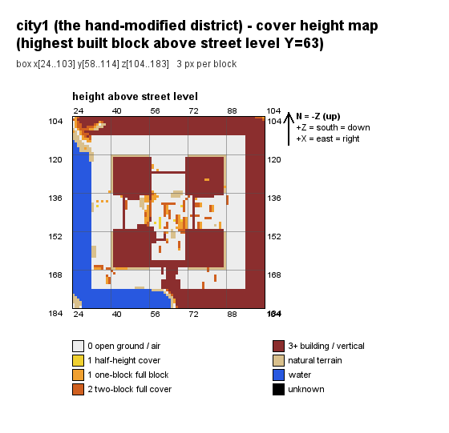
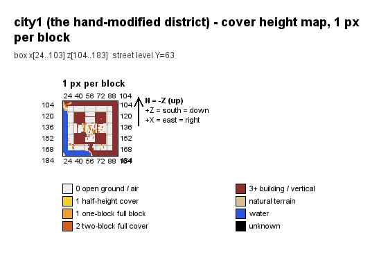
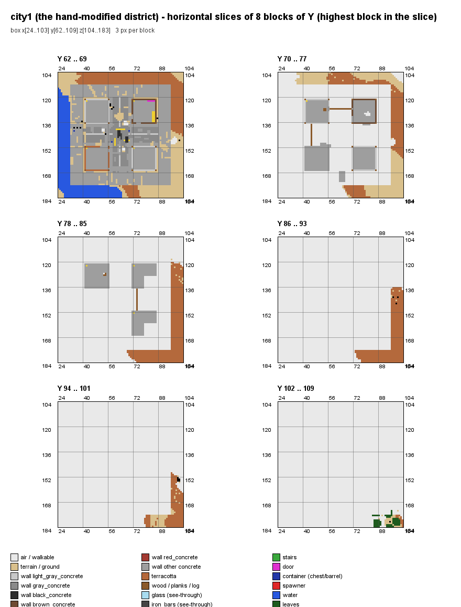
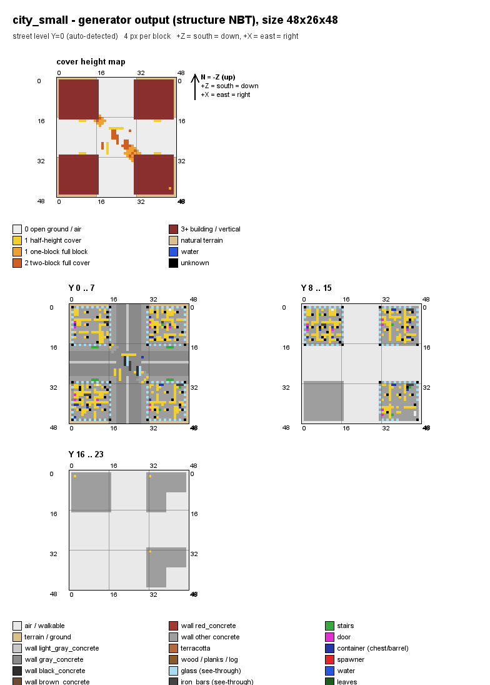
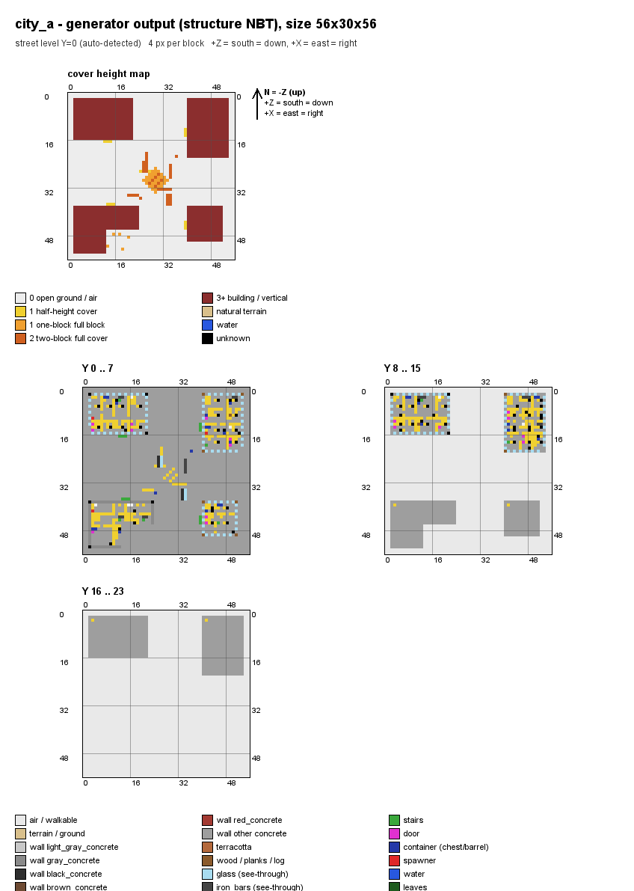
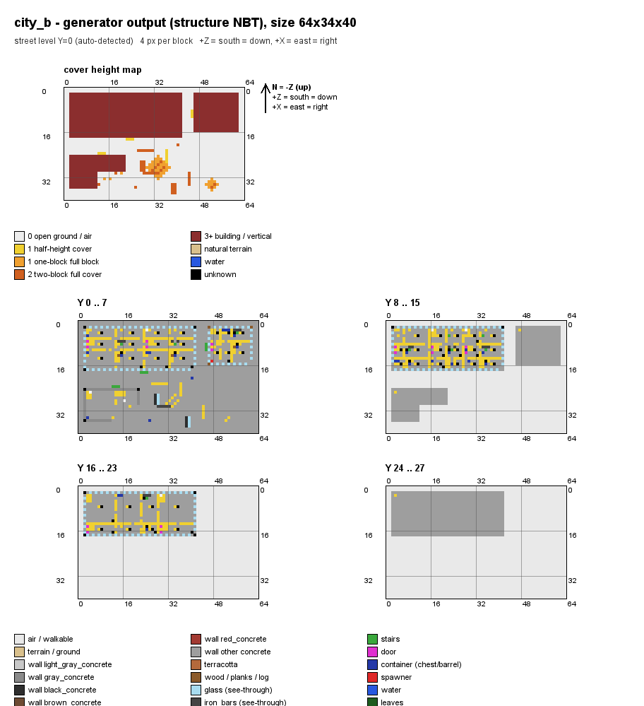
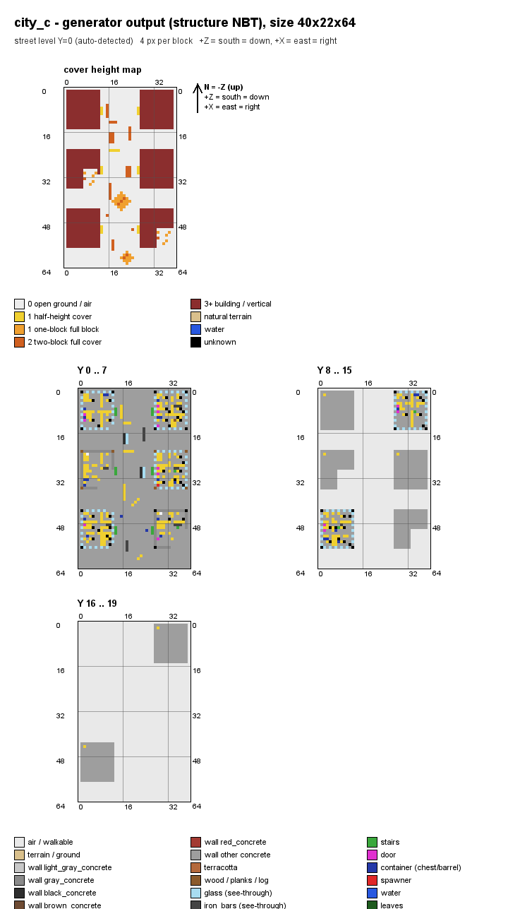
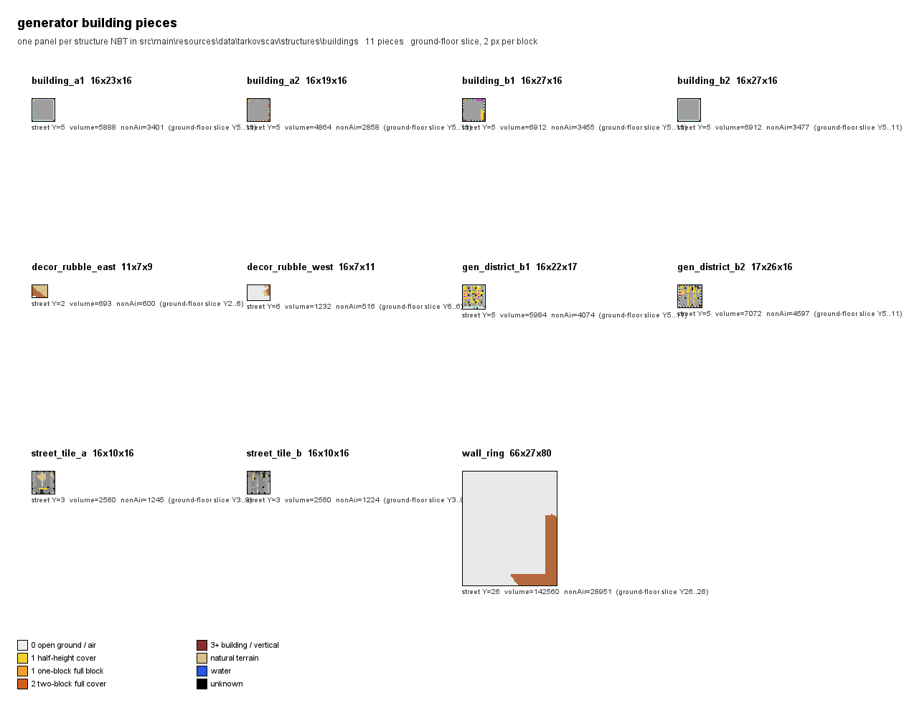
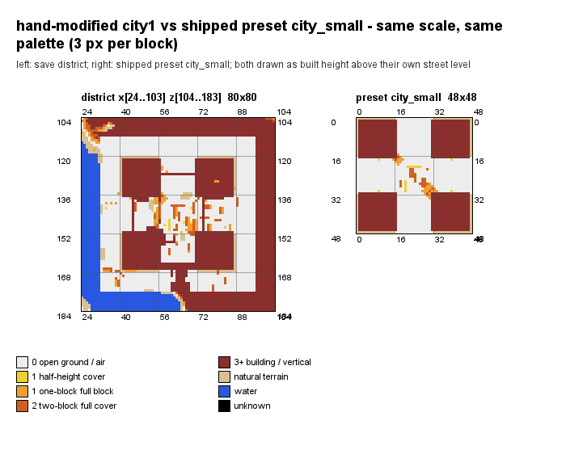

# 城市战城区调研（Armed Mobs / `tarkovscav`）

调研对象：`C:\TESTv3\.minecraft\versions\1.20.1-Forge_47.4.3\saves\塔科夫城市-可编辑`（下称“该存档”）
调研方式：直接解码 Anvil region 文件与结构 NBT，全程只读；不改存档、不改实例、不跑 gradle。
所有数字都由 `D:\deepseek\ArmedMobs\tools\spike\work\citymap\` 下的三个工具实测得到，日志留在同目录（`chunkscan.txt`、`final\*.log`）。

---

## 0. 摘要（先看这一段）

1. **手工改造的城区 = `city1`**，世界坐标 `x[24..103] y[59..98] z[104..183]`（80×40×80）。
   判定证据见 §3；决定性证据是里面 5 个 `tarkovscav:creative_weapon_rack`（本模组**仅创造模式可得**的方块，任何已发布的 `.nbt` 里都没有它）和 2 个 `white_wall_banner`。
2. 另外 6 个城区（`city2`..`city7`）在生成器材料计数上高度一致（例如 `polished_andesite` 4053、`light_gray_concrete` 1262、`deepslate_tiles` 1103 在 5 个城区里逐块相同），且**一个门、一张床、一面旗、一个武器架都没有**，判为未改动的旧生成器产物。
3. **“半高掩体线”这个指标我一开始算错了口径，现已修正**（定义与四个变体见 §4.2）：旧口径把**窗玻璃/染色玻璃板/铁栏杆/地毯/床**，以及**贴着整面墙的 `stone_brick_wall` 墙裙**都算成“半高掩体”，于是 `city_small` 得到 340 条“线”；而真正可用的线（实心、上方通透、旁边能站人）只有 **2 条** —— 和存档城区的 **2–3 条**基本一样。
   修正后的结论更有价值：**所有城区都几乎没有可用的低位掩体线**；现在生成器的真实优势是**可用零星掩体格的数量是旧产物的 23–41 倍/单位面积**（`city_small` 222 格 vs `city1` 19 格，按面积归一后 96.4 vs 3.0 每 1000 格），但它们**排不成线**（只有 5.0% 的可用掩体格落在 ≥3 的直线里，旧产物反而是 57.9%）。
   ⇒ 生成器要改的不是“从零造掩体”，而是“**把已经有的掩体排成线**”。
4. 设计提案（§7）：把 `~18 栋楼做成一个大型据点`，实测每栋楼需要 **≈3557 个方块**（含 5 层地基），18 栋 ⇒ **≈64,000 方块**，需要 **138×66（≈9,100 格）** 的占地；同时把 `add_scavs.json` 的权重总和 **33 → 15**、`spawn.cityRegionPadding` **24 → 4**（可刷怪面积 −52.7%）。

---

## 1. 怎么做的（可复核）

### 1.1 新增工具（全部在 `tools/spike/work/citymap/`）

| 文件 | 作用 |
| --- | --- |
| `ChunkScan.java` | 遍历存档 `region/` 里**每一个** chunk，按“来源”和“障碍类别”分类计数，输出 CSV/TSV 与文本报告 |
| `Voxel.java` | 体素读取层：既能读结构 NBT，也能读存档的一个盒子（保留方块属性，例如门的 `facing`） |
| `ObstacleScan.java` | 单个城区的战斗功能障碍清单（全高/半高/连线/透视/门/缺口/垂直/室内/掩体密度）。**半高掩体线**给出 4 个口径变体（V1 旧口径 / V2 仅实心 / V3 实心+上方通透 / **V4 可用 = 设计口径**），并打印逐方块明细，便于人工核对 |
| `CityMap.java` | 用 `ImageIO` 出图（俯视高度图、分层切片、preset、构件拼版、并排对比） |

编译（Java 21；`-encoding UTF-8` 是因为被复用的旧源码注释里有中文）：

```
"C:\Program Files\Java\jdk-21.0.12\bin\javac.exe" -encoding UTF-8 -d tools\spike\work\citymap\out ^
  tools\spike\NbtReader.java tools\spike\citysave\NbtRewriter.java ^
  tools\spike\work\citymap\Voxel.java tools\spike\work\citymap\CityMap.java ^
  tools\spike\work\citymap\ObstacleScan.java tools\spike\work\citymap\ChunkScan.java
```

因为存档目录名含中文，先把 overworld 的 region 目录**复制**到 ASCII 路径再读（存档本身零写入）：

```
Copy-Item "...\saves\塔科夫城市-可编辑\region" -Destination tools\spike\work\citymap\region_snapshot\region -Recurse
```

### 1.2 “生成器产物 vs 手工放置”怎么判（这是本次调研的核心方法）

不用材料猜，而是**先算出生成器自己的方块词表**：把该模组发布的 16 个结构 NBT（`structures/city_small|city_a|city_b|city_c|gen_district.nbt` + `structures/buildings/*.nbt`，共 11 个构件）的 palette 取并集，得到 **63 个方块 id** 的“生成器词表（`GEN`）”。然后每个方块三分：

* `GEN`：生成器能放出来的 ⇒ **不能**当作手工证据；
* **自然地形**（该存档是恶地+大湖，所以整套 `*_terracotta`、`sand`、`water`、`lava`、`clay`、砂砾、矿脉、树木、海草都算地形）⇒ 排除；
* **`ARTIFACT` 类**（只有玩家/放置特征才会放的方块，且不在 `GEN` 里）：例如 `tarkovscav:creative_weapon_rack`、`white_wall_banner`、`smooth_sandstone`、各种 `_planks/_fence/_bed/_stairs/WALL`。落在这一类的方块 = **手工/外来结构候选**。

复现命令（全图扫描，6450 个 chunk，4 秒）：

```
java -Xmx2g -cp tools\spike\work\citymap\out ChunkScan ^
  --world tools\spike\work\citymap\region_snapshot ^
  --gen src\main\resources\data\tarkovscav\structures ^
  --boxes tools\spike\work\citymap\boxes.txt ^
  --csv tools\spike\work\citymap\chunks.csv --names tools\spike\work\citymap\chunk_names.tsv ^
  --ymin -64 --ymax 319 --top 40
```

---

## 2. 全图扫描结果（谁被改了）

* `chunksRead=6450`，`chunksUnreadable=0`，`blocksCountedInYRange=634,060,800`（y −64..319），耗时 4 s。
* `DIM-1/`、`DIM1/`、`dimensions/` 下**没有任何 region 文件**（只有 `data/capabilities.dat`），所以 overworld 的 `region/`（11 个非空 `.mca`，合计 43,384,832 字节）就是该存档的全部已生成地形与建筑 —— 本次扫描覆盖 100%。
* 全图 `ARTIFACT` 候选里，量最大的是**矿道/村庄/其他模组结构**（`oak_planks`、`rail`、`cobweb`、`mossy_cobblestone`、`dirt_path`、`farmland`、`spawner`、`chest` 成片散布在 20+ 个互不相邻的 cluster 里），以及两处集中的“非本模组建筑”：
  * `x[528..591] z[256..367]`：`smooth_sandstone` 1744 + `cut_sandstone` 563 + `smooth_sandstone_slab` 304 + `smooth_sandstone_stairs` 82 + `birch_planks` 60 + `wall_torch` 18（沙漠风格大建筑群，**不在任何 `cityRegions` 盒子里**）；
  * `x[240..287] z[352..416]`：`dark_oak_planks` 873/`dark_oak_fence` 610（含 `dark_oak_stairs` 及 `stripped_*`），**只有一小角伸进 `city6` 的东南角**。注意全图 `dark_oak_log = 0`，且同类深色橡木簇在 `z=16 / 224 / 240 / 288 / 320 / 592 / −80` 等 10+ 处重复出现 ⇒ 判为**外部世界生成物**，不是玩家手改。

### 2.1 配置盒逐项对照（`spawn.cityRegions` 内实测）

`gen` = 生成器词表方块数（不含被划为自然地形的 `*_terracotta`/`sand`/`gravel` 等），`ARTIFACT` = 手工/外来候选方块数。
（`gen`/自然/非生成器/`ARTIFACT` 数据来自 `ChunkScan` 的 per-box 汇总；y 范围按配置盒裁剪。）

| 盒子 | `gen` | 自然 | 非生成器 | `ARTIFACT` | 门 | 室内物件 | 楼梯 | 武器架 | 旗帜 | `spawner` |
| --- | ---: | ---: | ---: | ---: | ---: | ---: | ---: | ---: | ---: | ---: |
| `1`（湖） | 31,698 | 2,362,852 | 105,115 | 24 | 0 | 0 | 0 | 0 | 0 | 0 |
| `city1` | 27,895 | 1,178,055 | 44,760 | **14** | **16** | **22** | **6** | **5** | **2** | **4** |
| `city2` | 28,609 | 1,135,009 | 46,498 | 3 | 0 | 2 | 0 | 0 | 0 | 1 |
| `city3` | 29,361 | 1,093,433 | 86,133 | 3 | 0 | 2 | 0 | 0 | 0 | 1 |
| `city4` | 30,800 | 1,084,801 | 80,309 | 6 | 0 | 3 | 0 | 0 | 0 | 3 |
| `city5` | 27,390 | 1,159,905 | 1,422 | 39 | 0 | 2 | 0 | 0 | 0 | 3 |
| `city6` | 25,569 | 980,060 | 20,027 | 349 | 0 | 4 | 0 | 0 | 0 | 1 |
| `city7` | 27,807 | 772,543 | 42,554 | 454 | 0 | 2 | 0 | 0 | 0 | 2 |

> 口径：`gen`/自然/非生成器/`ARTIFACT` 来自 `ChunkScan`，它按 **chunk 粒度**归入盒子（与盒子重叠的整块 chunk 都算，且不限 y），所以会有边界误差；门/室内/楼梯/武器架/旗帜/`spawner` 来自 `ObstacleScan`，是盒子内的**精确**计数。
> **已核对的一处差异**：`city1` 的 `spawner`，`ChunkScan`（chunk 粒度）说 5，`ObstacleScan`（精确）与独立的 `RegionStat find` 都说 **4**。第 5 个在 `(55, -21, 96)` —— y=−21 的**地下刷怪笼**（地牢），z=96 也在 `city1` 盒子（z104..183）之外，只是落在重叠 chunk 里。表格取精确值 **4**。
> `gen` 列**不含**恶地自然生成的 `terracotta` 系（已归入“自然”），所以比“只按生成器词表统计”小得多 —— 这是刻意避免把山坡当建筑。
> `1` 号盒子的 `ARTIFACT=24` 全是 `oak_planks`（一处矿道），与“自然湖泊”的结论一致。
> `city6`/`city7` 的 `ARTIFACT` 高，是因为把 `dark_oak_planks/fence`（外来结构）与 `oak_planks/cobweb`（矿道）都算了进去；见 §3.3 的反证。
> `city1` 的 `ARTIFACT=14`（chunk 粒度）= `tarkovscav:creative_weapon_rack` 5 + `white_wall_banner` 2 + `spawner` 5 + `chest` 2；**盒内精确值 = 12**（武器架 5 + 旗帜 2 + 刷怪笼 4 + 箱子 1）。量小但**性质**完全不同（见 §3.2）。

`city2`..`city7` 的“室内/低掩体”明细（`ObstacleScan`，精确）：全部只有
`glass_pane 443–494`、`cobblestone_wall 13–18`、`iron_bars 8`、`barrel 2–3`（`city6` 另有 `dark_oak_fence 48` 与 `wall_torch 2`，来自外部结构），**没有**门、床、楼梯、石砖墙、钟、武器架、旗帜。

`gen` 侧的“同款证据”（越小越能证明这些城区是同一套构件反复放置）：

| 方块 | city1 | city2 | city3 | city4 | city5 | city6 | city7 |
| --- | ---: | ---: | ---: | ---: | ---: | ---: | ---: |
| `polished_andesite` | 4119 | 4053 | 4053 | 4265 | 4053 | 4053 | 4053 |
| `light_gray_concrete` | 1299 | 1262 | 1262 | 1480 | 1262 | 1262 | 1262 |
| `deepslate_tiles` | 1103 | 1103 | 1103 | 1213 | 1103 | 1103 | 1103 |
| `gray_concrete` | 754 | 784 | 784 | 1271 | 784 | 784 | 784 |
| `brown_concrete` | 571 | 627 | 627 | 627 | 627 | 627 | 627 |
| `cobblestone` | 443 | 187 | 190 | 440 | 450 | 146 | 83 |
| `ladder` | 49 | 49 | 49 | 58 | 49 | 49 | 49 |
| `white_bed` | **14** | 0 | 0 | 0 | 0 | 0 | 0 |
| `spruce_door` | **10** | 0 | 0 | 0 | 0 | 0 | 0 |
| `dark_oak_door` | **6** | 0 | 0 | 0 | 0 | 0 | 0 |

`city2/3/5/6/7` 前 5 行逐块相同 ⇒ 它们是**同一套旧生成器的重复放置**。`city1` 与 `city4` 偏离；`city1` 是唯一多出**门/床/楼梯/石砖墙/钟/武器架/旗帜**的。

---

## 3. 城区 `city1` 的定位与“改了多少”

### 3.1 位置与识别方式

* 世界：该存档 overworld（`region/r.0.0.mca`、`region/r.0.1.mca` 等）。
* 区域盒（来自实盘配置 `spawn.cityRegions`）：`city1|minecraft:overworld|24 59 104|103 98 183`。
* 街道平面（自动检测，方法：把“顶端方块上方有 ≥3 格可通行”的列按 y 投票取众数）：**y=63**；该层实测为 `smooth_stone 2420 + coarse_dirt 1024 + gray_concrete 784 + light_gray_concrete 76`（`city1` 为 `smooth_stone 2184 + coarse_dirt 1020 + gray_concrete 754 + light_gray_concrete 76`），即平台面 + 道路嵌条。
* 最高建造方块：`city1` y=108（含城墙环上的塔），`city6` y=94。分析窗口取 `y[63..108]` / `y[63..94]`。

### 3.2 决定性证据：`city1` 独有、且不可能来自世界生成的方块

| 方块 | 数量 | 坐标 | 为什么是手工 |
| --- | ---: | --- | --- |
| `tarkovscav:creative_weapon_rack` | 5 | `(87,64,133) (39,64,135) (84,65,132) (46,65,156) (42,65,165)` | 本模组 `ModBlocks.CREATIVE_WEAPON_RACK`，**只有创造模式物品栏能拿到**（`WeaponRackItem` 自带 `tooltip.noRecipe`），16 个已发布结构 NBT 里 **0 个** |
| `white_wall_banner` | 2 | `(48,67,135) (50,67,135)` | 玩家放置物；不在 `GEN` 词表 |
| `spawner` | **4** | `(79,65,128) (44,65,131) (48,65,158) (78,65,159)` | 不在 `GEN` 词表。**盒内精确值 4**（`RegionStat find` 独立复核 = 4）。`ChunkScan` 的 chunk 粒度口径会给出 5，第 5 个是 `(55,-21,96)` 的**地下地牢刷怪笼**（y=−21，z=96 也在盒子外） |
| `chest` | 1 | `(34,64,141)` | 不在 `GEN` 词表 |
| `stone_brick_wall` ×6 + `stone_brick_stairs` ×6 | 12 | 拱门：`(47,65,137)(51,65,137)(47,65,138)(51,65,138)(47,66,138)(51,66,138)` + `(48..50,64,138)` | 两柱三阶的**门拱**，位置在 NW/SW 两楼之间的街道正中（x47..51, z137..138），生成器不在街区中央放拱门 |
| `white_bed` ×14 | 14 | `x84..85, y69, z129..135`（2×7 整齐排布） | 与 `buildings/building_b1.nbt` 里的 **14 个 `white_bed` 数量完全相同** |
| `spruce_door` ×10、`dark_oak_door` ×6、`bell` ×1、`torch` ×1、`barrel` ×2 | 20 | `bell (85,71,131)`；门在同两栋楼 | 与 `building_b1.nbt`（`spruce_door` ×10、`bell` ×1）和 `building_a1.nbt`（`dark_oak_door` ×6）**数量逐项吻合** |

> 关键点：配置注释写明 `structures/buildings/*.nbt` 是“**从用户存档里切出来的手工构件**”（"the hand-built pieces cut out of the user's save"）。上面 46 个家具方块与这些构件的数量逐项一致 ⇒ `city1` 就是**这些构件被切走之前/之后的那个城区**。而 5 个创造模式武器架 + 2 面旗帜是**生成器永远放不出来**的东西。

### 3.3 诚实的反证（避免误判）

* `city6` 的 `dark_oak_planks 191 / dark_oak_fence 118` **不是**手工：它集中在 `x240..287, z352..416`，只有一角在 `city6` 盒内，同类深色橡木簇在全图 10+ 处重复出现，且全图 `dark_oak_log = 0`（掠夺者前哨站必然有原木）⇒ 判为**外部结构的边缘**。
* `city7` 的 `oak_planks 343 / cobweb 108 / rail 49`：典型**废弃矿道**签名（`oak_planks`+`oak_fence`+`rail`+`cobweb`+`wall_torch`+`chest`），全图散布 3000+ `rail`。
* `city1` 的 16 个门里有 10 个 `spruce_door` 在城内两栋楼里（与 `building_b1` 吻合）；另有 `x[88..104] z[168..190]` 处的楼梯/门堆（`district_floors.png` 的 `Y102..109` 面板右下角）属于**伸进盒子东南角的塔状外部结构**，不计入手工城区本体。
* `city4` 的细节方块几乎是 `city2/3/5/6/7` 的 **2 倍**（`gray_concrete` 1271 vs 784、`cobblestone` 440、`black_concrete` 48 vs 24、`cobblestone_wall` 26 vs 13、`iron_bars`/`tinted_glass` 16 vs 8、`barrel` 4 vs 2、`ladder` 58 vs 49）—— 但**没有任何家具/门/床**。**推断**（未证明）：这一格被同一套结构放置了两次或压了两个实例。

### 3.4 “改了多少”的量化

分析窗口 `y[63..108]`，盒子 80×86×80：

| 指标 | `city1`（手工） | `city6`（未改动旧产物） |
| --- | ---: | ---: |
| 非空气方块 | 42,256 | 41,557 |
| 生成器/玩家“建造”方块 | 32,559 | 34,702 |
| 窗口内自然地形方块 | 9,697 | 6,855 |
| 生成器词表外、且不可能自然生成的方块（**盒内精确**） | **12**（5 武器架 + 2 旗帜 + 4 `spawner` + 1 `chest`） | 0（`ChunkScan` 按 chunk 粒度在相邻 chunk 里找到过 1 个 `spawner`） |
| 与已切出构件数量吻合的家具 | **46** | 0 |
| 方块种类 | 52 | 40 |

即：**材料层面 99.96% 仍与旧生成器一致**，改动是“外科手术式”的几十个方块（家具、门拱、旗帜、刷怪笼、武器架），**不是**一整栋新楼。这一点很重要——说明用户此刻处在“开始在既有城区里加内容”的阶段，而不是“重建了一个城区”。

---

## 4. 障碍清单（战斗功能分类）

三列对照：`city1`（手工） / `city6`（未改动旧城区） / `city_small`（**现在生成器**的产物，读自 `structures/city_small.nbt`）。
复现命令示例：

```
java -Xmx2g -cp tools\spike\work\citymap\out ObstacleScan --label city1 ^
  --world tools\spike\work\citymap\region_snapshot --box "24 45 104 103 130 183" ^
  --gen src\main\resources\data\tarkovscav\structures --signature 1
java -Xmx2g -cp tools\spike\work\citymap\out ObstacleScan --label city_small ^
  --nbt src\main\resources\data\tarkovscav\structures\city_small.nbt --gen src\main\resources\data\tarkovscav\structures
```

### 4.1 汇总表

| 指标（**实测**） | `city1` 手工 | `city6` 未改动 | `city_small` 现在生成器 |
| --- | ---: | ---: | ---: |
| 分析窗口 | y63..108 | y63..94 | y0..22 |
| 建造方块数 | 32,559 | 34,702 | 11,408 |
| ① 全高遮挡方块 | 32,037 | 34,015 | 9,121 |
| ① 建造高度 ≥2 的列 | 2,748 | 2,666 | 1,055 |
| ② 半高类方块（**旧口径**：含窗玻璃/板/铁栏杆/地毯/床） | 372 | 523 | 2,015 |
| ② **实心低掩体**方块（新口径：不透明、0.5–1.5 格高） | 35 | 63 | 1,543 |
| ② 实心且**上方通透**（暴露）的格 | 24 | 15 | 309 |
| ② 实心+暴露+**旁边可站人**的格（= 可用掩体格） | 19 | 15 | 222 |
| ② 可用掩体**线** V1（旧口径：任意半高类，同 Y 连续 ≥3） | 9 | 4 | **340** |
| ② 可用掩体线 V2（仅实心低掩体） | 5 | 2 | 303 |
| ② 可用掩体线 V3（实心 + 上方通透） | 4 | 2 | 4 |
| ② **可用掩体线 V4（实心 + 上方通透 + 旁边可站人）= 设计口径** | **3**（11 格，最长 5） | **2**（11 格，最长 6） | **2**（11 格，最长 6） |
| ② 可用掩体格中落在 ≥3 线内的比例（成线率） | 57.9% | 73.3% | **5.0%** |
| ③ 透视掩体 | 530 | 579 | 723 |
| ④ 门/活板门/栅栏门方块 | 16 | 0 | 67 |
| ④ “实心墙中 1 格宽缺口” | 91 | 32 | 7 |
| ⑤ 楼梯 | 6 | 0 | 17 |
| ⑤ 半砖 | 0 | 0 | **147** |
| ⑤ 梯子/脚手架 | 49 | 49 | 99（含 `chain` 64） |
| ⑤ 梯子所在列 | 4 | 4 | 4 |
| ⑤ **推断**楼层数（可走格 y 直方图局部极大） | 10 | 8 | 6（y=1,6,10,14,18,22） |
| ⑥ 室内物件 | 22（床14/武器架5/刷怪笼4/桶2/箱1/火把1） | 4 | 151（桶87 + 灯64） |
| ⑦ 掩体密度（可走格 3 格内有建造掩体的比例） | 0.756 | 0.633 | **0.828** |
| ⑦ 街面空地率（街面可走格 3 格内无掩体） | 0.310 | 0.536 | 0.354 |

### 4.2 逐类说明（哪些是量出来的，哪些是推出来的）

**① 全高视线阻断（2 格以上实心）** — 实测：`city1` 32,037 块 / 2,748 列；`city_small` 9,121 块 / 1,055 列。
`city1` 的构成（`FULL_HEIGHT_hist`）：`terracotta 8011 + orange_terracotta 6124 + polished_andesite 4119 + smooth_stone 2406 + brown_terracotta 2316 + white_terracotta 1475 + light_gray_concrete 1299 + light_gray_terracotta 1258 + deepslate_tiles 1103 + ...` —— 注意**外墙环（terracotta 系）占了 1.9 万块**，它把整个城区围成一个封闭盒子，这是 `city_small`（无外环）没有的结构。

**② 半高/低掩体 + “成线”（本报告修正过的指标）**
一句话定义：**把同一 Y 上沿 X（或 Z）连续 ≥3 个“可用低掩体”格算作 1 条线**，其中“可用低掩体”= 实心、不透明、约 0.5–1.5 格高、**上方是通透的**（不是一整面墙的墙裙）、且**旁边同一 Y 有可站人的格**；X 与 Z 两个方向分别统计，最大值、不跨 Y、不含自然地形/树叶/水。

四个变体（`ObstacleScan` 会全部打印，便于手算核对）：

| 变体 | 方块集合 | 附加条件 |
| --- | --- | --- |
| V1（我最初的错误口径） | 任意“半高类”：`*_slab/_stairs/_wall/_fence/_fence_gate`、`*_pane`、`glass_pane`、`iron_bars`、`*_carpet`、`*_bed`、`hay_block`、`barrel`、`chest`、`cauldron`、`composter` … | 无 |
| V2 | 仅**实心**低掩体（剔除透视的 `*_pane`/`iron_bars`，剔除无躯干遮挡的 `*_carpet`/`*_bed`） | 无 |
| V3 | 同 V2 | **上方必须通透**（否则它是一面墙的底部） |
| **V4（设计口径）** | 同 V2 | 上方通透 **且** 同 Y 四邻至少一格可站人 |

**为什么必须改**：V1 的 340 条里，绝大多数是 `city_small` 建筑外墙的 `stone_brick_wall` **墙裙层**（`solidLowBlocks=1543`，其中 `stone_brick_wall` 约 1115）和**窗玻璃** —— 前者玩家永远用不上（背后是整面墙），后者根本挡不住子弹。加上“上方通透”这一条，`city_small` 从 303 条掉到 **4 条**；再加上“旁边可站人”，掉到 **2 条**。**存档城区的 2–3 条几乎不变** —— 也就是说，**旧口径的 38 倍差距是纯粹的分类假象**。

**修正后的真实结论**（这才是设计该用的数字）：
* **可用掩体格**（V4 格）：`city_small` 222 / `city_a` 218 / `city_b` 240 / `city_c` 229，而 `city1` 19、`city6` 15、`city2/3/5/7` 15、`city4` 21。按单位面积（每 1000 格）算：preset 约 **70–96**，存档城区约 **2.3–3.3** ⇒ 现在生成器的零星低掩体密度是旧产物的 **约 23–41 倍**。
* **成线率**（可用掩体格中落在 ≥3 直线里的比例）：preset **0–5.0%**，存档城区 **57.9–76.2%**。
  ⇒ 存档城区那 15–21 个可用掩体格几乎**全部**来自生成器 `cover` 列表里那两道 5–6 格的矮墙（所以成线率高，但总量少得可怜）；现在生成器**材料多了 30 倍，却把它们摊成了 1–2 格的窗台/墙墩**，几乎不成线。
  ⇒ **生成器要改的不是“从零造掩体”，而是“把已经有的掩体排成 ≥3 的直线”。**
* 逐方块明细（`LOW_SOLID_hist`）：`city_small` = `stone_brick_wall 1115 + oak_fence 166 + oak_slab 117 + barrel 87 + cobblestone_slab 30 + oak_stairs 13 + cobblestone_wall 11 + stone_brick_stairs 4`；`city1` = `cobblestone_wall 19 + stone_brick_stairs 6 + stone_brick_wall 6 + barrel 2 + bell 1 + chest 1`。

**③ 透视掩体** — 实测：`city1` 530（`glass_pane 315 + oak_leaves 158 + ladder 49 + iron_bars 8`），`city_small` 723（`light_gray_stained_glass_pane 346 + oak_fence 166 + glass_pane 96 + chain 64 + ladder 35 + iron_bars 8 + tinted_glass 8`）。
`city_small` 多了**染色玻璃窗带 + 橡木栅栏**，两者分别提供“可看见但打不穿”和“可打穿但挡视线”的层次。

**④ 门与缺口** — 实测门方块（含 `facing` 属性）：`city1` 16 个（`north 12 / east 2 / west 2`；`spruce_door` 5 扇 + `dark_oak_door` 3 扇）；**`city2`..`city7` 全部为 0**；`city_small` 67 个（`north 59 / south 8`，含 34 个 `oak_trapdoor`）。
“1 格宽缺口”= 水平两对面都是全高实心、自身是整格空气且脚下有地板的格：`city1` 91、`city6` 32、`city_small` 7。
⇒ 存档城区的建筑**没有门**（只有窗洞/门洞），室内外连通靠整片缺口；`city_small` 每栋楼有真门，可以形成“可控出入口”。

**⑤ 垂直性** — 实测楼梯/半砖/梯子数、以及梯子所在列数；**楼层数是推断**：把“可走格（脚下实心、头顶空、自身可通行）”按 y 计数，取局部极大（阈值 ≥16 格）并强制间隔 ≥2。
`city_small` y=1/6/10/14/18/22 共 6 层，每层 `oak_slab`/`stone_brick_wall` 构成楼层掩体；`city1` 推断 10 层（因为 `city1` 的分析窗口含城墙环塔，噪声更大），但**楼梯只有 6 格、且没有半砖**，屋顶通达基本靠 49 格梯子（4 列）。

**⑥ 室内** — 实测。`city_small` 有 87 个桶 + 64 个灯笼；`city1` 有 14 张床 + 5 个武器架 + 4 个刷怪笼 + 1 个钟；`city6` 只有 3 个壁火把 + 1 桶 + 1 箱 + 1 刷怪笼。`tarkovscav:*` 方块：`city1` 5 个，其余 6 个城区 **0**。

**⑦ 空地/掩体密度** — 实测，定义：对每个可走格 `(x,y,z)`，看以它为中心 `Chebyshev 半径 3`、`y` 与 `y+1` 两层的 48 个邻居里，是否存在**建造类**掩体（全高/半高/透视/门）；`city1` 0.756、`city6` 0.633、`city_small` 0.828。
**注意（会影响横向比较）**：三个盒子的 y 窗口、地形高度、城墙环的有无都不同，所以 0.756 与 0.633 的差**不能**单独证明“手工城区更好”。干净可比的是 `city1` 与 `city_small`（同一套分类规则）以及 `city1` 与已切出构件（同一批材料）。

---

## 5. 地图

全部图在 `docs/maps/`，尺寸与字节数见表后。

| 图 | 说明 |
| --- | --- |
|  | `district_height.png`（560×541）：手工城区 `city1`（`x[24..103] y[58..114] z[104..183]`）的**掩体高度图**。白=街面空地，黄=半高掩体，橙=1 格全高，深橙=2 格全高，暗红=3 格以上（楼体/城墙环），棕=自然地形，蓝=水。**+Z 朝下（南），+X 朝右（东），北 = −Z**。 |
|  | `district_height_1px.png`（560×381）：同一张图的 **1 px = 1 格**版本。 |
|  | `district_floors.png`（880×1157）：同一城区的 **6 个 8 格高切片**（`Y62..69 / 70..77 / 78..85 / 86..93 / 94..101 / 102..109`），每格取切片内最高方块。可以看到街面层（`Y62..69`）的城墙环、4 栋楼、街道与橙色掩体点；也暴露了东南角伸进来的外部塔（`Y102..109` 的绿/洋红点）。对比 `preset_city_c.png` 的 `Y0..7` 面板可以看到：preset 的黄色（半高掩体）成片，`city1` 只有零星点。 |
|  | `preset_city_small.png`（784×1095）：现在生成器的 `city_small`（48×26×48）。上半是高度图，下半是 `Y0..7 / 8..15 / 16..23` 三个切片 —— 楼里能看到黄（半高掩体）、绿（楼梯）、洋红（门）、深蓝（桶）。 |
|  | `preset_city_a.png`（848×1191）：`city_a`（56×30×56），同样画法。 |
|  | `preset_city_b.png`（912×999）：`city_b`（64×34×40），同样画法。 |
|  | `preset_city_c.png`（720×1287）：`city_c`（40×22×64），同样画法。 |
|  | `pieces_buildings.png`（1260×995）：`structures/buildings/` 里 11 个构件的**底层平面图**（每格 2 px）+ 名称/尺寸/体积/非空气方块数/街道 y。 |
|  | `district_vs_preset.png`（700×557）：手工城区 `city1` 与 `city_small` **同比例、同调色板**并排。 |

PNG 尺寸与大小（逐个用 `System.Drawing.Image` 读回校验，全部非空、非单色）。**这一版是标题换行后的重出图**：所有画布都保证标题完整（`city1 ... cover height map` 等长标题折成两行，窄图的最小宽度从 420/664 提到 560/700）：

| 文件 | 像素 | 字节 |
| --- | --- | ---: |
| `district_floors.png` | 880×1157 | 57,979 |
| `district_height.png` | 560×541 | 25,217 |
| `district_height_1px.png` | 560×381 | 18,947 |
| `district_vs_preset.png` | 700×557 | 29,200 |
| `pieces_buildings.png` | 1260×995 | 42,771 |
| `preset_city_a.png` | 848×1191 | 52,992 |
| `preset_city_b.png` | 912×999 | 52,909 |
| `preset_city_c.png` | 720×1287 | 50,983 |
| `preset_city_small.png` | 784×1095 | 48,779 |

> 图内文字全部用英文：该 JDK 在 headless 下默认逻辑字体没有 CJK 字形，为了避免出“豆腐块”，图例与标题一律 ASCII；中文说明只放在本文件里。

---

## 6. 手工城区 vs 现在生成器产出的城区

地图与实测数字共同指出的差别，按“对城市战的影响”排序：

1. **低掩体的“成线率”才是真正的差距（修正后）**
   用可用口径（V4）：`city_small` 只有 **2 条** ≥3 格的可用低掩体线，`city_a` 0 条、`city_b`/`city_c` 各 1 条；存档城区 `city1` **3 条**、`city6` 2 条。**直线数量上双方一样差**。
   真正的差别在**可用掩体格的总量**：preset 218–240 格（每 1000 格 70–96 个），存档城区 15–21 格（每 1000 格 2.3–3.3 个）—— 差 **23–41 倍**。
   但 preset 的这些掩体格**只有 0–5% 排在 ≥3 的直线里**（存档城区反而是 58–76%）。
   ⇒ 现在生成器“有材料、没队形”：窗台、墙墩、单桶到处都是，能依托的横线却没有。**这是生成器最值得改的一条**，而且不需要增加方块预算。
   （旧报告里“340 条 vs 9 条”是我的分类口径错误，已在 §4.2 更正并说明原因。）
   **附带发现（对 §7 提案很关键）**：`buildings/` 的 6 个楼构件，用 V4 口径实测可用线 = **0 / 0 / 0 / 0 / 0 / 1**（`gen_district_b2` 1 条 3 格），`gen_district.nbt` = 0。**单栋楼里根本没有可依托的低掩体线** —— 现在 preset 那 2 条线来自 `city-layout*.json` 的 `cover` 列表（街面上的矮墙/沙袋），不是来自楼。提案若只在 `district-layout.json` 里加楼，掩体线仍然是 0，必须同时给街面/楼层补 `cover` 元素（§7.3 第 2、3 条）。

2. **门的有无（chokepoint）**
   `city_small` 67 个门/活板门（`north 59 / south 8`）；存档 6 个未改动城区**一个门都没有**，只有 91（`city1`）/32（`city6`）个“实心墙 1 格缺口”。
   ⇒ 旧产物是“空心盒子”，室内外是一条整开的洞；攻方无法用门做节奏控制，守方也无法封门。

3. **垂直层次与屋顶通达**
   `city_small` 147 个半砖 + 17 个楼梯 + 99 梯子/链，楼层可辨（y=1/6/10/14/18/22）；存档城区 **0 半砖、0–6 楼梯**，垂直移动全靠 49 格梯子（只有 4 列）——即每栋楼基本只有一条上楼路线。
   ⇒ 屋顶狙击位在旧产物里是“一条梯子守住全楼”。

4. **室内密度**
   `city_small` 室内物件 151（87 桶 + 64 灯笼）；`city1` 22；`city6` 4。
   ⇒ 旧产物的楼里几乎是空的，没有可搜刮/可依托的家具层。

5. **外墙环 vs 开放街区**
   存档城区有一圈 terracotta 城墙（约 1.9 万块），把 80×80 围成一个封闭盒子，出入口少；`city_small` 没有城墙，是 4 栋楼 + 十字街 + 街面掩体。
   ⇒ “据点感”旧产物更强，但**内部空地率过高**（`city7` 街面空地率 0.91），进去之后没东西可打。

6. **掩体密度**
   `city1` 0.756 / `city6` 0.633 / `city_small` 0.828，街面空地率 0.310 / 0.536 / 0.354。
   （再次声明：三者 y 窗口与地形不同，只作趋势参考。）

---

## 7. 设计提案：`~18 栋楼 = 一个大型据点` + `降低城区刷怪率`

> 以下是**提案**，一律**未执行**。所有数字都来自上面的实测。

### 7.1 每栋楼要多少方块（实测基准）

`buildings/` 6 个“楼”构件（含 5 层地基的完整非空气方块数 / 街道面以上的方块数）：

| 构件 | 尺寸 (x×y×z) | 非空气方块（含地基） | 街道面以上 |
| --- | --- | ---: | ---: |
| `building_a1` | 16×23×16 | 3,401 | 2,121 |
| `building_a2` | 16×19×16 | 2,858 | 1,578 |
| `building_b1` | 16×27×16 | 3,456 | 2,175 |
| `building_b2` | 16×27×16 | 3,477 | 2,197 |
| `gen_district_b1` | 16×22×17 | 3,844 | 2,559 |
| `gen_district_b2` | 17×26×16 | 4,304 | 3,109 |
| **平均** | ~16×24×16 | **≈3,557** | **≈2,290** |

⇒ 18 栋 ≈ **64,000 方块**（含地基）/ **41,200 方块**（街道面以上）。
参照：现在最大的 preset `city_b` 只有 13,876 个非空气方块、191,623 字节的 NBT；`city_small` 11,408 块 / 135,157 字节。
⇒ 18 栋据点的 NBT 大约 **0.8–1.0 MB**（按每非空气方块 ~13.8 字节的实测比率），可以接受，但已经是“大结构”。

### 7.2 18 栋需要多大占地（实测推算）

现状 `tools/district-layout.json`：`size = [48, 30, 32]`，只有 **2 栋楼**（`gen_a` 在 `x1,z1`，`gen_b` 在 `x31,z1`，各 16×16，8 格街宽 ⇒ 列距 24、行距 30）。**即：现有池子一“格”只装 2 栋。**

按同样的 16×16 楼 + 8 格街（列距/行距 = 24）排 **6 列 × 3 行 = 18 栋**：

```
x: 1, 25, 49, 73, 97, 121   （最后一栋占 121..136 ⇒ size.x = 138）
z: 1, 25, 49                （最后一栋占 49..64   ⇒ size.z = 66）
⇒ 建议 size = [138, 34, 66]，占地 138×66 = 9,108 格，NBT 体积 309,672
```

竖向：最高构件 27 + 5 层地基 = 32 ⇒ `size.y = 34` 足够（现有 30 只够 4–5 层）。
街区/掩体预算（**用修正后的口径**）：`city_small` 的 222 个可用掩体格分布在 48×48 = 2,304 格上 ≈ **0.096 格/㎡**，9,108 格 × 0.20 ≈ **≥1,800 个可用掩体格**（密度翻倍）。但**关键不是这个总量**，而是成线率：`city_small` 只有 5.0% 的可用掩体格落在 ≥3 的直线里，据点目标 **≥40%** ⇒ 约 **≥720 格** 应当排进 **≥48 条** 可用线（每条 3–7 格）。方块总预算不用增加：`city_small` 已经有 1,543 个实心低掩体方块，只是摊成了 1–2 格的窗台和墙墩。

### 7.3 具体、最小的改动清单（**请用户确认后再做**）

| # | 文件 | 现在 | 建议改成 | 依据 |
| --- | --- | --- | --- | --- |
| 1 | `tools/district-layout.json` | `size=[48,30,32]`，`buildings` 2 条 | `size=[138,34,66]`，`buildings` 18 条（6×3 网格，`x∈{1,25,49,73,97,121}`、`z∈{1,25,49}`） | §7.2 实测推算；现有池一格只装 2 栋 |
| 2 | 同上，每栋的 `min_cover_per_floor` | `7` | `≥12`，并新增 `min_cover_lines_per_floor: 2`（口径必须是 §4.2 的 **V4 可用线**，不能用旧 V1），且**指标要落在装配后的街区**（含 `street_tile_*` 的 cover 元素），不能只落在单栋楼上 | 实测：`buildings/` 的 6 个楼构件 V4 可用线 = **0/0/0/0/0/1**（`gen_district_b2`），`gen_district.nbt` = 0；而它们的旧口径 V1 却是 0/0/3/0/76/95 —— 单栋楼的“线”几乎全是墙裙/窗玻璃。街面掩体只能来自 `street_tile_a`（V3=1）与 preset 的 `cover` 列表 |
| 3 | `worldgen/template_pool/city_district/building.json` | 6 条元素，权重 `3,3,2,2,2,2` | 保留 6 条，但把 11 个 `buildings/*.nbt` 里可用的“楼”都加进来（当前只用了 6 个，`street_tile_*`/`decor_*`/`wall_ring` 走别的池）；**并给 `street_tile_*` 增加成线的低掩体**（这是唯一能提供街面掩体的构件，实测 V3 线只有 1 条） | 池子大小决定据点里楼的多样性；掩体线只能靠街面构件 |
| 4 | `worldgen/structure/city_district.json` | `size: 6`、`max_distance_from_center: 128` | `size: 20`、`max_distance_from_center: 224` | 18 栋要展开到 138×66，128 的半宽装不下 |
| 5 | `worldgen/structure_set/city_district.json` | `spacing: 48`、`separation: 20` | `spacing: 192`、`separation: 48` | **必须改**：spacing 48 < 据点宽度 138，现在两个据点会叠在一起 |
| 6 | `tags/worldgen/structure/city.json` | 已含 `tarkovscav:city_district` | 不动 | 已核实，据点已经会开刷怪门 |
| 7 | `config → spawn.cityStructureIds` | `["tarkovscav:city_small"]` | `["tarkovscav:city_small", "tarkovscav:city_district"]` | 让据点也走 (a) 判据，不依赖 tag |
| 8 | `data/tarkovscav/forge/biome_modifier/add_scavs.json` | 权重 `12,6,4,3,2,2,2,1,1`（合计 **33**） | `5,2,2,1,1,1,1,1,1`（合计 **15**） | 见 §7.4 的口径说明 |
| 9 | `config → spawn.cityRegionPadding` | `24` | `4` | 可刷怪面积 `(80+48)²=16,384` → `(80+8)²=7,744`，**−52.7%** |
| 10 | `config → spawn.scavCityOnly` / `gunnerPillagerCityOnly` / `gunnerVillagerCityOnly` | 全 `true` | 不动 | 已经是“只在城区刷” |

### 7.4 “降低城区刷怪率”的口径（这点必须说清楚）

* Minecraft 的 `spawners.weight` 是**同一生物类别内的相对权重**。把本模组 9 个刷怪项**等比例**调小，只会改变“本模组 vs 原版僵尸/骷髅”的占比，**不会**按比例降低绝对刷怪次数；所以 #8 的有效口径是：**把本模组在 `monster` 类别里的权重总量从 33 压到 15（−54.5%）**，其中 `scav` 12→5（−58%）、`gunner_pillager` 6→2（−67%）。
* **真正线性的“城区刷怪率”旋钮是 `spawn.cityRegionPadding`**（#9）：它直接决定“多大范围算城区”，而 `scavCityOnly=true` 时只有城区内才刷。24→4 让每个城区的可刷怪面积 −52.7%。
* 另有 4 个自然权重写在 `Config.java` 而不是 JSON（实盘值：`usecVillagerWeight=2`、`bearPillagerWeight=2`、`eliteVillagerWeight=1`、`elitePillagerWeight=1`），与 `add_scavs.json` 里同名条目**重复**；改 #8 时要么一起改，要么明确以哪一份为准（本次未改，仅记录）。
* 如果用户想要“只降城区、不动野外”的干净旋钮，需要**新增**一个配置键（例如 `spawn.citySpawnWeightScale = 0.5`）并在刷怪门里乘上去 —— 这是一处代码改动，**本次未做**，也不在最小改动集里。

### 7.5 提案的“验收指标”（都能用本次工具复测）

| 指标（全部用 §4.2 的同一口径复测） | 现在 `city_small` | 18 栋据点目标 |
| --- | ---: | ---: |
| **可用掩体线 V4**（实心+上方通透+旁边可站人，≥3 格同一 Y） | **2 条**（11 格） | **≥48 条**（18 栋 × ≥2 条 + 街道 ≥12 条） |
| 可用掩体线 V3（只要求上方通透） | 4 条 | **≥120 条**（每条街段与每层楼都应有） |
| 可用掩体格（V4 格） | 222 格（0.096 格/㎡） | **≥1,800 格（≥0.20 格/㎡）**，即现在是 2 倍密度 |
| **成线率**（可用掩体格里落在 ≥3 直线内的比例） | **5.0%** | **≥40%** ← 最关键的一条，且**不需要增加方块预算** |
| 门/活板门方块 | 67 | **≥120**（18 栋 × ≥4 樘门 + 楼内活板门） |
| 楼梯 + 半砖 | 17 + 147 | 按每栋 ≥1 条上房路线：**≥18 处楼梯 + ≥180 半砖** |
| 梯子所在列 | 4 | **≥18**（每栋至少 1 列） |
| 室内物件 | 151 | **≥400**（18 栋 × ≥20） |
| 街面空地率 | 0.354 | **≤0.40** |
| 掩体密度（弱指标，含墙脚，仅作回归检查） | 0.828 | **≥0.80**（不得下降） |

> 说明：原提案写的是“≥300 条半高掩体线”，那是基于**错误口径**（V1）定的，现在作废。用 V1 当验收指标的话，现在这个 preset 已经“达标”了，等于没验收。上表的 48/120 条是按“每栋楼 2 条 + 每条街 1 条”的**可用**口径定的，`city_small` 现状 2 条 / 4 条，差距才是真的。

---

## 8. 结论分区

### 已证明（有坐标、有计数、有可复现命令）

* 该存档 overworld 共 6,450 个 chunk 全部解码成功，`DIM-1/DIM1/dimensions` 没有 region 文件 ⇒ 扫描覆盖 100%。
* 该存档是**恶地＋大湖**地貌：全图 `water 6,301,476`、`sand 644,039`、`light_gray_terracotta 444,794`、`red_terracotta 331,779`、`lava 166,423`、`clay 155,705`（所以这些**不能**当建造证据）。
* `spawn.cityRegions` 里 `1`（`-383 34 -132`..`-254 163 -3`）确实是自然地貌，无建造特征。
* **手工改造的城区是 `city1`**（`x[24..103] y[59..98] z[104..183]`，街面 y=63）：里面有 5 个 `tarkovscav:creative_weapon_rack`（`ModBlocks` 里注册、`tooltip.noRecipe`、16 个已发布 NBT 中 0 个）、2 个 `white_wall_banner`、4 个 `spawner`、1 个 `chest`。
* `city1` 另有 `white_bed`×14、`spruce_door`×10、`dark_oak_door`×6、`stone_brick_wall`×6、`stone_brick_stairs`×6、`bell`×1 —— 与 `structures/buildings/building_b1.nbt`（床 14、云杉门 10、钟 1）和 `building_a1.nbt`（深色橡木门 6）**数量逐项一致**。
* `city2`..`city7` 的 `polished_andesite` / `light_gray_concrete` / `deepslate_tiles` / `gray_concrete` / `brown_concrete` / `ladder` 计数在 5 个城区上完全相同，且门/床/旗/武器架全为 0。
* `city6` 的深色橡木与 `city7` 的橡木/矿道痕迹来自**外部世界生成**（全图 `dark_oak_log = 0`，同类簇在 10+ 处重复）。
* `city_small` 实测：门 67、楼梯 17、半砖 147、室内 151、掩体密度 0.828、**可用掩体格 222**；但**可用掩体线 V4 只有 2 条**（V1 旧口径的 340 条是分类假象，见 §4.2）。`city_a`/`city_b`/`city_c` 的 V4 线分别为 0 / 1 / 1 条。
* `city2`/`city3`/`city5`/`city6`/`city7` 的可用掩体格**也完全相同**（15 格、2 条线、11 格在线内），`city1` 19 格 / 3 条 / 11 格，`city4` 21 格 / 3 条 / 16 格 —— 这是“`city2/3/5/6/7` 是同一套产物、`city1` 与 `city4` 偏离”的**独立佐证**。
* 6 个“楼”构件平均 **3,557** 方块（含 5 层地基）/ **2,290** 方块（街面以上）。
* 现有 `tools/district-layout.json` 是 `size=[48,30,32]` 且只放 **2 栋**；`structure_set/city_district.json` 的 `spacing=48` **小于** 18 栋所需的 138 宽。
* `add_scavs.json` 权重合计 33；`spawn.cityRegionPadding = 24`；`cityStructureIds` 只列了 `city_small`；`tags/worldgen/structure/city.json` 已包含 `city_district`。

### 需用户肉眼确认（我只能给证据，不能替你拍板）

1. `city1` 里那 46 个家具方块，是你**手放**的，还是旧生成器（`building_a1/b1` 那套构件被切走之前）留下的？两者数量完全一致，我无法从存档区分。
2. `city4` 的细节方块约为其他城区的 **2 倍**（`gray_concrete` 1271 vs 784、`cobblestone_wall` 26 vs 13、`iron_bars`/`tinted_glass` 16 vs 8、`barrel` 4 vs 2）却没有家具 —— 是**同一结构放了两次**，还是那里本来就比较特殊？请开创造飞过去看一眼。
3. `x[528..591] z[256..367]` 的 `smooth_sandstone`/`cut_sandstone`/`birch_planks` 大建筑群，以及 `x[240..287] z[352..416]` 的深色橡木簇：如果不是你建的，就是别的模组的世界生成（旁边有 `guaniao:crow_nest`）。
4. `city1` 东南角 `x[88..104] z[168..190]`、y≥98 的塔（带楼梯与门）是否为外部结构伸进来。
5. 18 栋据点到底要“**一个巨型单体结构**”还是“**jigsaw 自动拼**”？提案 §7.3 里 #1–#2 是“单体巨型结构”路线（确定、可测，但 NBT ~1 MB），#3–#5 是“jigsaw 池”路线（灵活，但一次能拼出几栋取决于连接点目标，我**没有**在游戏里实测过）。
6. 8 栋/格的实际街区手感、每层 `min_cover_lines` 取 3 是否够 —— 需要进游戏走一遍。

### 未核对（本次没有能力/没有权限测的）

* **掩体线指标本身仍有一个人为选择**：V4 要求“旁边同一 Y 有可站人的格”，这会**排除掉紧贴整面墙的矮墙**（身后是墙、身前是街的那种，实战里其实能用）。我选它是因为它能把“墙裙”和“真掩体”分开；如果用户认为“贴墙矮墙”也算，应当用 V3（`city_small` 4 条 / `city1` 4 条 / `city_a` 9 条），结论方向不变（都很少），但 V3 的数字更大。<br>另外 V4 的“可站人”只要求 4 邻之一，**没有**做“从街道可达”的连通性检查，所以夹在封闭天井里的掩体线也会被计入（本次未发现这种案例，但没证明不存在）。
* **没有运行游戏**（按任务要求不跑 gradle、不跑 `selftest.ps1`、不动 `mods/`），所以：
  * jigsaw 一次实际拼出多少栋楼、连接点是否成功匹配 —— 未实测；
  * 现在的 `district-layout.json`（2 栋）在游戏里刷出来的样子 —— 未实测；
  * 18 栋布局的**性能**（区块加载、刷怪寻路）—— 未测；
  * `add_scavs.json` 改权重后的实际刷怪次数 —— 未测（`logSpawnGate = true` 已经在实盘打开，可以在游戏里数日志验证）。
* 玩家实体/`poi` 数据未读（`poi/`、`entities/` 目录），所以“用户上次站在哪、城区里有没有村民/据点”未核对。
* `guaniao` / `moreblocke` / `emods` 等其它模组的结构清单未核对，§3.3 里“外来结构”的归属是**推断**。
* `city2/3/5/6/7` 各自的结构签名（`SIGNATURE_footprintGE2`）**两两不同**（`af433800…` / `5517b3c2…` / `c6978879…` / `80edec9c…` / `ea7f4d33…`），但该签名含地形与城墙环，**不能**用来证明“未被改动”，因此我没有把它当证据。
* 存档的 `level.dat` / `session.lock` 时间戳未核对（任务里已给的“最后写入 2026-09-25 20:50、游戏已关闭”我没有重新验证）。
* `ObstacleScan` 的 `FULL_HEIGHT` 只统计**建造类**方块，自然地形（恶地山坡、石山）被排除；若你要“含地形的总掩体量”，需要另跑一版（本次未跑）。
* 1 px 版本的 `district_height_1px.png` 只有高度图，没有分层切片。

---

## 附：本次新增/使用的文件

工具（`D:\deepseek\ArmedMobs\tools\spike\work\citymap\`）：
`ChunkScan.java`、`Voxel.java`、`ObstacleScan.java`、`CityMap.java`、`boxes.txt`，以及 `chunkscan.txt`、`chunks.csv`、`chunk_names.tsv`、`final\*.log`、`region_snapshot\`（存档 region 的只读副本）。

报告与图（`D:\deepseek\ArmedMobs\docs\`）：
本文件 + `maps\district_floors.png`、`maps\district_height.png`、`maps\district_height_1px.png`、`maps\district_vs_preset.png`、`maps\pieces_buildings.png`、`maps\preset_city_small.png`、`maps\preset_city_a.png`、`maps\preset_city_b.png`、`maps\preset_city_c.png`。

**存档、实例、`src/`、`mods/`、`gradle*` 全程零写入。**
